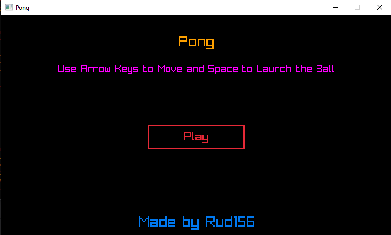
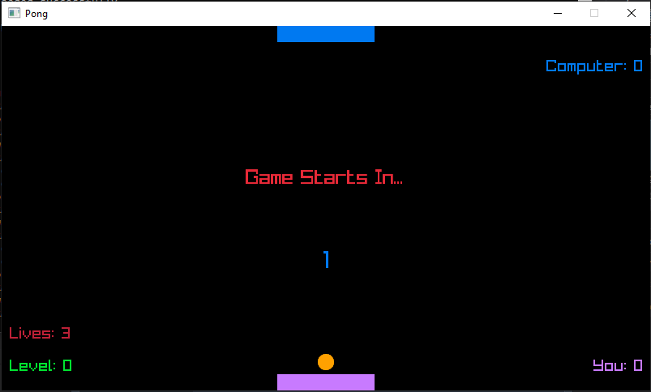
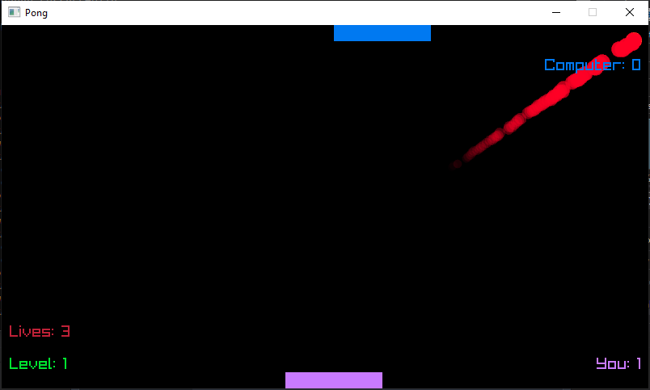
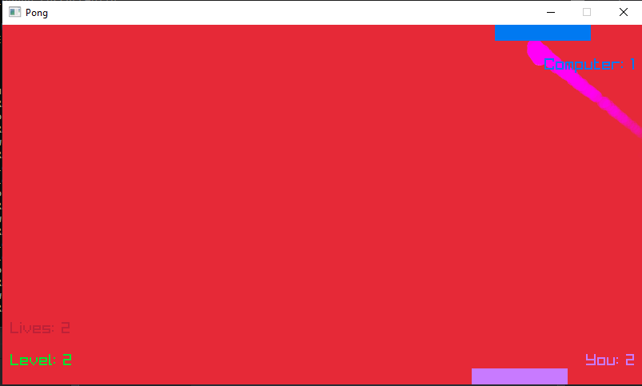

# Pong
#### A simple pong clone made using RayLib in C++
> Find out more about RayLib [here](https://www.raylib.com/).

### Objective:
Try to reach as high a level as possible without loosing 3 lives

### Controls:
- Use Left and Right Arrow Keys to move
- Press Space to launch the ball
- Press Esc to close the game

### Building The Game:
- You need to have raylib installed on your system
- Follow https://github.com/raysan5/raylib/wiki/Create-Visual-Studio-Project to setup the build system using Visual Studio

> Gameplay video can be found at https://github.com/Rud156/Pong/tree/master/Video/Pong.mp4

### Download:
> A built version of the game can be downloaded from https://github.com/Rud156/Pong/tree/master/Build/Pong.zip

### ScreenShots:

